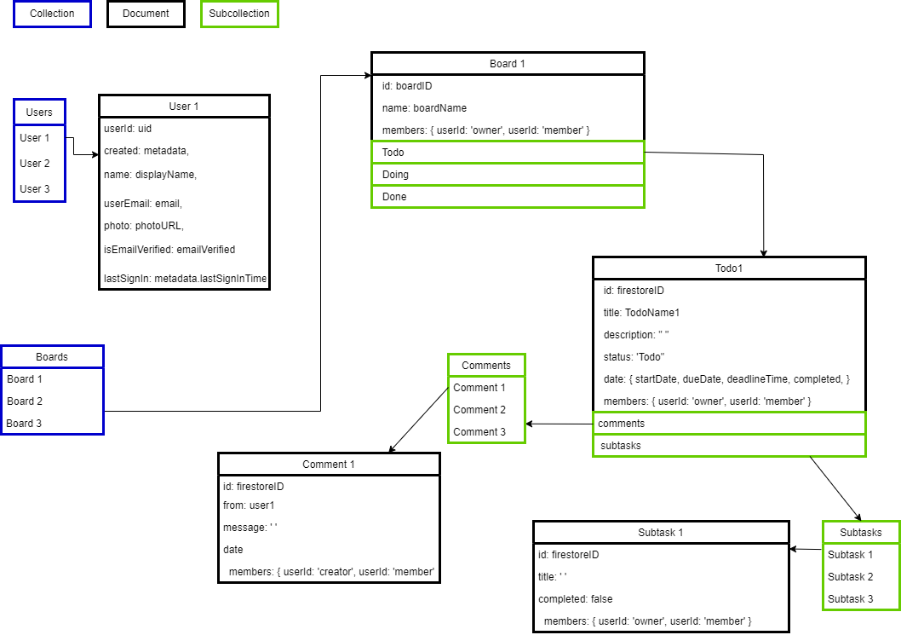

# Workspace

A work in progress task management app (Kanban board) specifically inspired by Trello.

## User stories

-   User can add a board/project
-   Each board has three categories: Todo, Doing, and Done
-   In every category, the user can add a task card
-   The user can open each task card, a modal will pop up
-   When the user opens the card modal, the user can do the following:
    -   Change card title
    -   Add card description
    -   Set and delete deadline
    -   Add and delete subtasks
    -   Change status of the card to either Todo, Doing, or Done
    -   Update card status completion by clicking the checkbox deadline or due date
    -   Update subtasks status completion
    -   User can drop comments and see team members' comments as well.
-   User can move the card to any category using Drag and Drop API

## Technologies

-   React
-   styled-components
-   react-icons
-   react-router v6
-   HTML Drag and Drop API
-   Firebase
    -   Authentication
    -   Cloud Firestore
    -   Hosting

## Motivation

The goal is to practice React with Firebase integration.

## Challenges

### Database and Data Structure

I chose the root-level collections as suggested by firestore. The reason is my app has a distinct need of sharing the boards to other users. Since copying a board to another user (a member) doesn't sound efficient, I opted to separate the boards collection and users collection. In this case, the users who share a board will only edit one board and its subcollections. Each board in boards collection will hold members (either the owner or a member). When a user logs in, frontend will query the boards collection one by one to fetch only the boards wherein users id are listed in the members object.

I am not pretty sure if this is faster since the app could have thousands of boards and it might take longer time to fetch one by one. However since this is just for practice, I guess this is not a bad data structure for my case.



### Invite System

I now faced the biggest hurdle so far in using firestore. I couldn't find a better and cheaper way for searching/filter a substring. Firestore doesn't have methods like .includes of JS or Firestore just don't support querying substrings of a strings in fields per document. Firestore suggests using third party solutions like Algolia.

I intend to make this app cost-free and yet secure. My app needed to safely query/filter substrings in the users collection in the database as I can't compromise the users data in the client-side.

I needed it for inviting other users to access a board, and therefore, leave comments.

I found a temporary solution suggested by Nick Carducci on [Stackoverflow](https://stackoverflow.com/questions/46568142/google-firestore-query-on-substring-of-a-property-value-text-search).
When a user signs in, I also include a name array where I will be using it in fetching the user doc by calling array-contains

```
    const name = email
        .split('@')[0]
        .split(/[^a-z]/i)
        .join(' ')

    const arr = []
    const e = (displayName || name).toLowerCase()

    for (let i = 1; i < e.length + 1; i++) {
        arr.push(e.substring(0, i))
    }

   // for filtering the users
    const matchedUser = 'the value inputted by the user'
    const queryUsers = query(
                collection(db, 'users'),
                where('nameArray', 'array-contains', matchedUser)
            )

```

I used this implying the user doesn't have a long name/last name because for free tier, the max dept for maps or array is 20 only.

## Learnings

### Firestore

#### addDoc vs. setDoc

| Differences                          | addDoc | setDoc                               |
| ------------------------------------ | ------ | ------------------------------------ |
| Can create a doc                     | Yes    | Yes                                  |
| Can use to overwrite a doc           | No     | Yes                                  |
| Can data be merged with existing doc | No     | Yes                                  |
| Can create custom ID                 | No     | Yes                                  |
| Can use Firestore auto-generated ID  | Yes    | Yes (by creating document reference) |

Both can be used to write a doc to a collection.
But setDoc can overwrite a document or update the document if you specify to merge the data. They said, use addDoc if you want a Firestore auto-generated ID, while use setDoc to specify a document with a custom ID. However, in this app, I use setDoc a lot because I can use fireStore auto-generated ID too by creating a document reference. Just make sure you have the collection within that code too.

Example:

**setDoc using Firestore auto-generated ID**

```
// board collection
        const boardCol = doc(collection(db, 'boards'))

        const boardObj = {
            name: 'Sample Board Title',
            id: boardCol.id,
            members: { [uid]: 'owner' },
        }

        await setDoc(boardCol, boardObj)
```

As you can see here, if I want to use an auto-generated id from firestore using setDoc, all I have to do is to call doc and mention collection. It is like saying, create a doc inside the collection boards. Then, in my boardObj, I used the boardCol reference as an id.

**SetDoc using custom ID**

```
await setDoc(doc(db, ‘boards’, ‘boardIDSample’), boardObj)
```

Here I’m just creating a doc by using setDoc. It is like saying, create a doc in my database, inside boards using this id.

#### setDoc vs. updateDoc

| Differences          | setDoc                                                                                 | updateDoc                                             |
| -------------------- | -------------------------------------------------------------------------------------- | ----------------------------------------------------- |
| If doc exists        | With merge, you are updating the fields. Without merge, you are overwriting the fields | You can update the fields without overwriting the doc |
| If doc doesn’t exist | With or without merge, you are creating the doc                                        | It will fail                                          |

I opted to use updateDoc, because I don’t want to automatically create a doc if the doc I’m trying to update doesn’t exist, especially for event listeners catered for updating data.

## Areas for Improvement

-   Additional features in the future

    -   Drag and Drop for on touch devices
    -   Sorting or ranking of task items per board status based on level of importance
    -   Add assign task to a person feature

-   Refactoring Needed
    -   Refactor the setDate/ Deadline Component
    -   Refactor repeated codes for UI like forms and inputs
